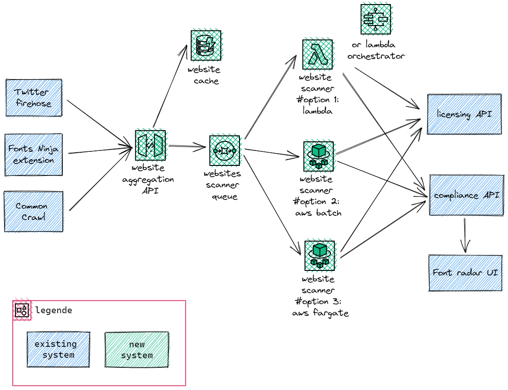

# Case Studies

## Test 1

### 1. How you would approach this challenge on a technical perspective? Please detail your methodology

The 2 main challenges that i see are aggregating the volume of websites that must be scanned, the second one is to process rapidly a website at scale.

My approch would be a proof of concept on these 2 aspects.

The first aspect is to determine the approximate volume of request that we are talking about based on different protocols (GRPC, HTTP) that are compatible with the existing sourcing solutions such as:

- Twitter firehose
- Fonts ninja extension
- Common crawl

Test with a cache and a queue system if we are able to handle on quick and dirty the projected number (X10) of domains that we want to discover.

The second aspect is to pick up a bunch of websites that are representative in term of complexity and size for scanning.
Study what is the necessary environment to scan these sites (libraries, execution time, resource consumption).
After having a pretty clear idea, find a way to run them in parallel behind a queue and study which metric we can use to scale the number of parallel scan execution.

### 2. Describe two solutions to help us reach this objective and detail pros & cons for each



The solution consist in having an API that will aggregate from sourcing systems the websites to scan, then find in a cache if the website has been already processed, if not put the scan request of this website into a queue, then a website scanner scan the website.
The scanner retreive the content that need to be qualified for licensing and send to the licensing API for check, the result of compliance is saved via complicance API.

The Pros of having a central API is to have one central point to aggregate all the websites to process regarding their source message format.

The cache will help to manage if a scan has already been done on this website.

The cons is that a significant volume of request will be made to this API, a proper scaling (vertical and horizontal) must be defined for this one.
AWS API gateway could be used for this, the benefits is to pay only for the requests used, but limits of requests per second must be studied first.

Another approach is to use containers of VMs to host this API, the cons is that we pay for execution time even when we receive no requests. Autocaling based on number of requests can be applied to scale horizontally.

Regarding scanners, the option 1 use AWS lambda, the benefit is to pay only for the execution time and compute size, while the developper only need to focus on the code that scan the website.
AWS Lambda's have limits of execution time (max 15min), max parallel number of execution (1000 for the entire account), have also limits in term of disk and memory size (10GB).
If a complex orchestration of multiple lambda functions is required AWS step functions can be used for that.

Another possibility would be to use AWS Batch, it is a solution that works with a queue and instanciate jobs that are running in containers.
The pros are that containers makes easy to package the scanner code and don't have the limits of lambda in terms of execution time.
AWS Batch also handle the autoscaling based on a minimum and a maximum provisionned capacity.
We pay only for the compute resource execution time required to scan the website.
The cons are to track the execution, the history of batched jobs is very minimal.
AWS Batch autoscaling mechanism is not very configurable, it must be studied first if it fits our needs.

A last option could be to run our scanners on AWS Fargate, this one use also containers, and we pay only for compute resources execution time but we need to implement manually the autoscaling mechanism, by doing so we can implement it the way we want without the limits of AWS Batch.

The Queue can run on AWS SQS, it is a managed service from AWS we only pay for the amount of message that we send to the queue.
The cons is that SQS have limits in terms of message size and in fligh.
These limits must be studied first to see if the solution can fit.

Overall, a big concern of this solution is that it does not reschedule the scan of websites.
If this must be handled, a more complex system must be put in place to save the list of all websites that must be scanned, and on a time based frequency be scheduled for scan or rescan. This solution describe the implementation of that part.

### 3. Choose one and explain how you would implement it with a small technical team

First, i would plan a design session with developer, infra and architecture lead.

If we have a person that represent the product side this person is required as well.

The goal of that design session is to picture a draft of a solution that could fit our constraints and requirements.

Then after that, we define a proof of concept and experiments about the approach that i described ealier, choose the persons in the team that will handle that part of the proof of concept and define a period when to evaluate the results.

We iterate until the PoC is enough relevant or if it proves that our approach is not the right one.

Then we define in terms of project management the items that must be developped and estimations about their developement and we dispath these items to team members.

We follow and track the advancement each day during a stand up meetings.

This meeting is also important to re-evalute the priorities if needed.

The roadmap that will be discribed bellow will be refined during meetings after the PoC. It will serve to define items in terms of project management.

Every 2 weeks a retrospective will be conduct with all the team members to see what we can improve in terms of project management and processes.

### 4. Provide a basic level architecture and roadmap of the solution

#### 4.1 Architecture diagram


#### 4.2 Roadmap

##### Phase 1 Prepare existing sourcing systems to point to the new scan system:

These existing sourcing systems must be prepared by implementing a switch to the new scan system and if possible redirect a part of the traffic from the existing scan system to the new one.

This part is important to load the new scan system progressively and make easy and configurable the switch to the new system that will aggregate all the traffic of the websites that must be scanned.

##### Phase 2 Implement the new scan system:

###### Part 1:

The new system will be divided into 2 parts:

The first part correspond to an API that aggregate websites that are found by our sourcing systems.

The API can be associated with a cache to determine if this website must be scanned or not. Each records in cache can expired.

The roadmap contain also the following items:

- API, Cache implementation (Dev, infra as code).
- API, Cache monitoring (metrics, struct logs, tracing).
- API, Cache pipeline delivery (Peer review, git flow, pipeline steps).
- API, Cache security implementation.
- API, Cache Documentation procedure (runbook, decision architecture record, code documentation).
- API, Cache cost management (apply tags to track resource associated costs and define alarm budget).

###### Part 2:

The second part of this architecture buffer sites that should be scanned in a queue and website scanners consume the content of the queue to empty it.
Then each time a site is scanned every content that should be licensed is checked against the licensing API and complicance result saved via compliance API.

- Website scanner, queue implementation (Dev, infra as code).
- Website scanner autoscaling.
- Website scanner throttlers and dead letter queue.
- Website scanner, queue monitoring (metrics, struct logs, tracing).
- Website scanner, queue pipeline delivery (Peer review, git flow, pipeline steps).
- Website scanner, queue security implementation.
- Website scanner, queue Documentation procedure (runbook, decision architecture record, code documentation).
- Website scanner, queue cost management (apply tags to track resource associated costs and define alarm budget).

##### Phase 3 Improve perf and optimize:

In that phase we observe the execution of the new system, define what can be optimized in terms of performance, delivery processes and costs. Then we implement what is possible.

## Test 2

### 1. How would you approach this? Please detail your methodology

The approach is first to have an audit of the existing architecture alone (CTO), then after that with the different people (each of them individually) that compose the team that contribute to this architecture, discuss with each of them and understand their set of skills, what they enjoy to do and what they don't, how they solve the main challenges of the piece of the infrastucture they manage.

Also ask them what they are proud of and what they don't.

Ask them on which part of the architecture they think there is a serious attention to be at, and what would be the necessary for them to do to solve this.

Based on the state of the delivery process (quality and automation mostly), and the willing they have to learn the gap, i will evaluate the gap of what we have and what we need based on the roadmap.

### 2. How would you handle someone from the team not working towards the same goal as you/the team?

The goal is to understand why.

Is it because of lack of knowledge ?

```
Proper training (online training and workshops) and support (project samples, documented patterns) can help them to apprend that.
```

Is it because they had a bad time/experience by doing this specifically ?

```
Evaluate what we could do differently by listening and discuss about why it failed.
```

Is it because they prefer to remain in their confort zone ? Don't want to learn new things or don't enjoy doing it ?

```
Find what they are really enjoy into that confort zone and see how 20% of their time could be affected to something outside their confort zone to learn.

Understand how far they like and don't like to do some tasks and se how to convinced them, if it is because the process to execute it or tooling is bad or if they don't fit at all for this such tasks.

The goal is to have a team of people that is complementary in term of skills, at some point i need also to face the team against their responsability and figure it out if we need to have someone hired or not to do the missing part.
```

Is it because they want to learn something specifically and my goal prevent them to do it ?

```
Evaluate what could be a good compromise, help the person to see my goal into an angle that could serve what he want to learn.
Maybe adapt my goal because this person have a really good point.
```

Is it because they want more responsability and my goal prevent them to do it ?

```
Understand what is looking for this person and evaluate a plan to give them little by little the scope that they looking for.

Evaluate this person with tasks and confront her with the results.
```

Is it because the organisation, the leadership vision changed ? And this person is not confortable with that ?

```
Help that person to understand that sometimes there are things that they connot control at their position/role in the company, sometimes it has been decided above for the best of the company.

Sometimes they need to give a bit trust and make a bet with the leadership in that new plan or vision and then evaluate if it is a success for them or not.
```

### 3. How would you handle someone that wants more challenges ?

I will try to understand first what is this challenge.

See how the actual scope of that person needs to be adapted or not and if i can adapt it based on workload, delivery dates and planned hires.

If it need to be reduced to assign X% of their time to this new challenge or if this person can absorb more challenge without reducing their actual scope.

Evaluate them on the progression and have 1 to 1 discussions to debrief about that and adapt accordingly.
